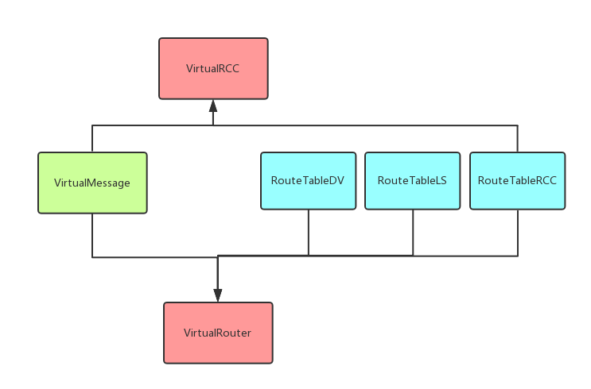

# 计网理论实验个人报告

> 2017-01-06
>
> 詹宗沅 15331386

[TOC]

## 一、前期准备

> 下面是本次实验中，个人实现部分

### 1.1 套接字编程，Unix网络编程基础

> 地址设置

```c++
// 参数类型
sockaddr_in client_address;
static char *CLIENT_IP;
static int CLIENT_PORT;

...

// 设置client_address IP
memset(&client_address, 0, sizeof(client_address));
client_address.sin_family = AF_INET;
client_address.sin_addr.s_addr = inet_addr(CLIENT_IP);
// 设置client_address PORT
client_address.sin_port = htons(CLIENT_PORT);
bzero(client_address.sin_zero, sizeof(client_address.sin_zero));
```

> 服务端，客户端套接字生成，及地址绑定

```c++
// 生成套接字，设置为流模式，使用TCP持续连接
server_socket = socket(AF_INET, SOCK_STREAM, 0);
// 绑定固定地址(地址包括ip+port)
socklen_t addrlen = sizeof(struct sockaddr);
if (::bind(server_socket, (struct sockaddr *)&server_address, addrlen)) {
  perror("bind fail");
  throw(new exception());
}
```

> 服务器等待连接

```c++
(*session_socket) = accept(server_socket, (struct sockaddr)&temp_client_address, &addrlen);
```

> 客户端请求连接

```c++
connect(client_socket, (struct sockaddr*)&neighbor_list[i].neighbor_address, sizeof(sockaddr_in));
```

>  建立稳定连接后客户端尝试发送，以及服务端等待接收报文

```c++
// 发送
send(neighbor_list[next_neighbor_index[i]].client_socket, encode_message, VirtualMessage::STR_MSG_LEN, 0);
```

```c++
// 接收
recv(session_socket, recvbuf, 512, 0);
```

<br>

### 1.2 多线程编程基础

这里引用pthread线程库

> 子线程创建

```c++
pthread_t receiving_thread;
if (pthread_create(&receiving_thread, NULL, startListenPort, &server_socket) != 0) {
  perror("Receiving pthread create fail");
  return;
}
```

子线程函数

```c++
void* VirtualRouter::sendData(void *fd);
```

多线程中需要对共用数据进行加互斥锁，并且采用生产者消费者模型设计信息的等待添加以及发送

> 生产者

```c++
// Add to message queue.
pthread_mutex_lock(&buf_mutex);
printf("%d DEBUG: addRoute lock.\n", session_socket);
sending_msg_buf.push(v_message);
pthread_cond_signal(&buf_cond);
pthread_mutex_unlock(&buf_mutex);
```

> 消费者

```c++
while (1) {
  pthread_mutex_lock(&buf_mutex);
  pthread_cond_wait(&buf_cond, &buf_mutex);
  // Send while isn't empty.
  while (sending_msg_buf.size() != 0) {
  ...
  }
  pthread_mutex_unlock(&buf_mutex);
}
```


<br>

### 1.3 设计程序结构

> 类关系图



> 程序结构


> router多线程设计

- 服务端主线程：等待neighbor router连接请求，连接即创建新线程等待接收该neighbor router发送的信息
- 服务器子线程（多个）：对每个已经接受服务的router开辟线程接收报文，并查看是否转发
- 探测线程：实现定时（每隔五秒）向邻居发送报文，探测是否连接，是否下线
- 客户端线程：对消息报文队列中的报文分发，查询路由表，发向不同的neighbor router或实现广播
- 输入线程：循环等待用户输入命令，就信息加入消息报文队列中

<br>

### 1.4 DV算法设计

参照PPT上的DV算法设计数据结构

`cost_table`


`route_table`

```c++
struct DVTableItem
{
  string next_ip;
  string dst_ip;
  int cost; //Default neighbor cost is 1
};

vector<struct DVTableItem> route_table;
```

<br>

### 1.5 RCC算法设计

使用Dijsktra算法设计


使用链接表记录拓扑图结构，每次更新整个拓扑图中每个节点到其他节点的最短路径，在Router Control Center计算每个路由的路由表。

<br>

### 1.6 设计程序交互

为了用户更好的测试和提高程序的可用性。

在主线程使用循环等待用户输入，控制发送信息给其他路由，主要交互命令如下：

```c++
In this version, router add command set as follow:

- 'send'  : send message to router with ip. 
- 'router': list neighbor routers information. 
- 'config': list router config. 
- 'route' : list route table. 
- 'exit'  : shutdown router and exit system. 
- 'help'  : list avaliable commands in system. 

```

<br>

## 二、构建程序

项目详情见github仓库：

https://github.com/zhanzongyuan/Virtual-routing

<br>

## 三、实验结果

详情见实验报告。

<br>

## 四、实验心得

1. 实验过程中学习和实践到了许多新的技术，套接字网络编程，多线程编程，DV算法设计，RCC算法设计，用户命令交互设计。
2. 程序的过程中出现了很多bug，特别是多线程的程序中，为此需要对许多共用的全局数据进行加锁处理。
3. 为了防止广播风暴，在设计时需要对重复广播过的报文丢弃。
4. 路由表的实现和前端的程序设计衔接上有许多问题，需要后期不断的实验调试修复，同时路由表信息交换需要实现报文的编码和解码。
5. 这次实验非分工不是太合理，应该提前分好工，做长期项目搭建。

